# 《从 1 到 100-模仿与创新的经营学》-井上达彦

## 1 模仿+必要+经验+引用+新鲜度

### 1.1 两种模仿

1. 为了提高自身，从遥远的地方，进行出乎意料的学习
2. 从顾客的利益着眼，从反面教材中学习良性的知识

### 1.2 Just in Time

- 必要的东西、在必要的时间，只取必要的量

### 1.3 他人的经验只能为我所用

### 1.4 引用

- 引用是很重要的。它具有被谈及的价值。
- 评级等级系统“PageMark”：基于网站的链接数和学术论文的引用数有着同样的思考，网页链接中，一些重要网页会产生许多外部链接，而另一些不会。对网页链接区别对待，只重视那些特定的、有许多扩展链接的网页即可。

### 1.5 香蕉、半导体、便利店的便当和时尚服务产业，其核心都是新鲜度的问题

- 印度露天商贩：一大早买入蔬菜和水果，必须在当天全部卖出，随着时间进行逐渐降价销售，在最合适的时机进行大甩卖。

## 2 商业模式+商业模式图例+良性模仿+遥远的世界进行模仿+放入括号而不论

### 2.1 商业模式

- 是向谁提供怎样的价值，为此怎样组合自己的经营资源，怎样调配自己的资源，怎样与商业伙伴和顾客进行交流，以怎样的流通渠道和价格体系进行运输，这些与商业模式有关的设计思想。

### 2.2 商业模式的系统图例

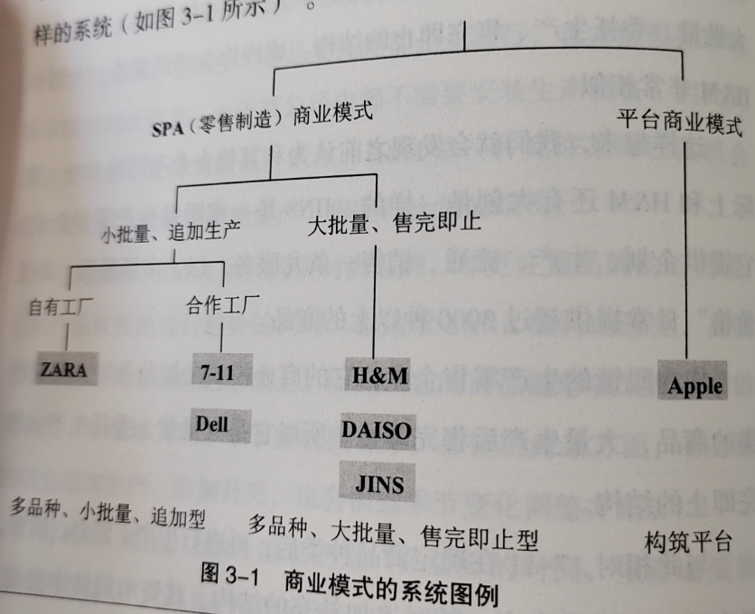

### 2.3 良性模仿与恶性模仿

- 良性模仿：垂直型的动作
- 恶性模仿：水平的横向滑动
- 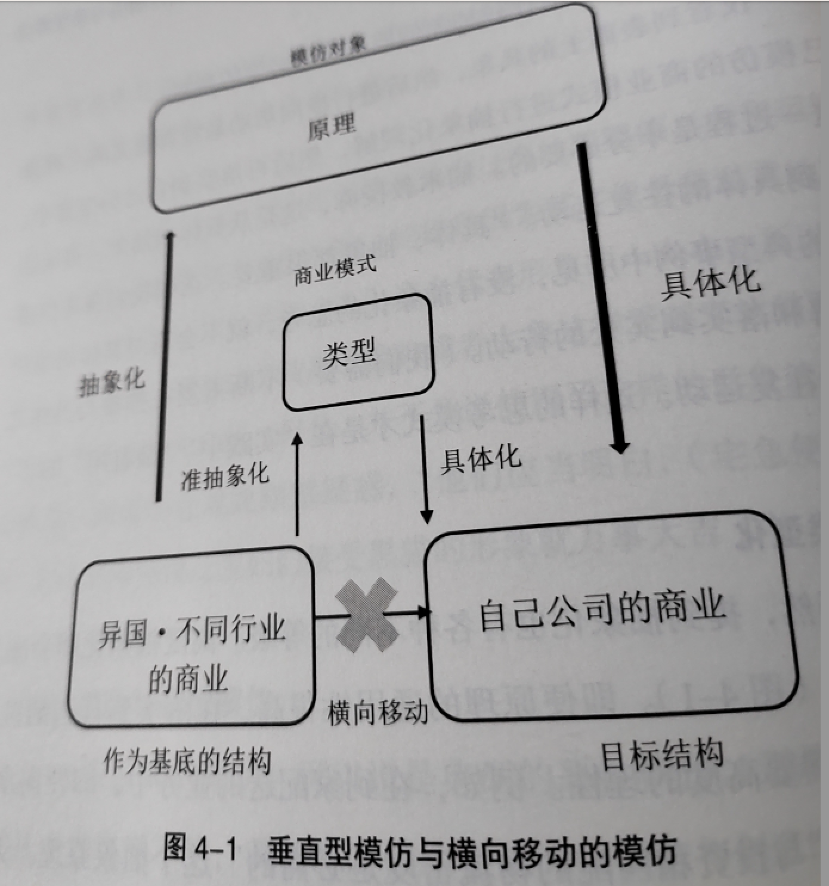

### 2.4 从“遥远的世界进行模仿”的三个层次

- 1.单纯的维持原样带入类型的“再生产”
- 2.根据情况变化加入一定的“变形”
- 3.获取新构想——“灵感”

### 2.5 放入括号而不论

- 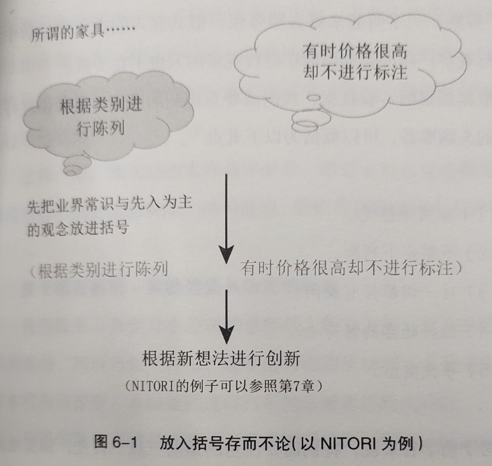

## 3 观察+网络行动者+格莱珉银行+自我否定+P-VAR

### 3.1 观察的注意事项

- 1.如实地接受
- 2.不要妄下判断
- 3.对一切都怀有疑问
- 4.保持旺盛的好奇心
- 5.寻找类型

### 3.2 网络行动者

- Catalyst（成为催化剂的人）
- Connector（帮助搭桥的人）
- Enabler（转化为现实的人）
- Promoter（广而告之的人）
- 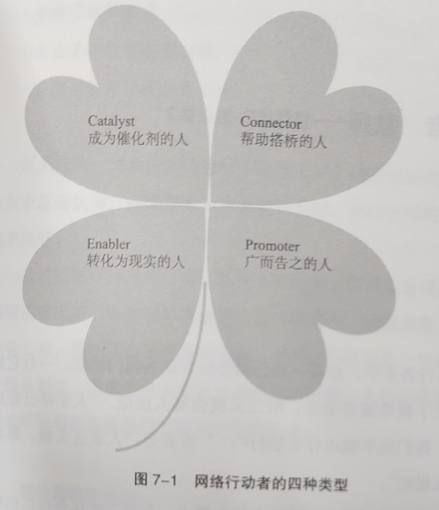

### 3.3 格莱珉银行的构想

- 之前的银行都把融资对象设定为有钱人,那格莱氓就设定为穷人
- 之前的银行都偏向大额交易，那格莱氓就做小额交易
- 之前的银行都在城市展开业务，那格莱氓就到农村去
- 之前的银行都需要担保,那格莱就不要
- 之前的银行都把男性作为主要客户，那格莱氓就针对女性
- 之前的银行都把顾客叫到银行来,那格莱氓就到顾客那里去拜访
- 之前的银行都要调取客户过去的履历,而对格莱琨来说产生威胁的只有客户的未来

- 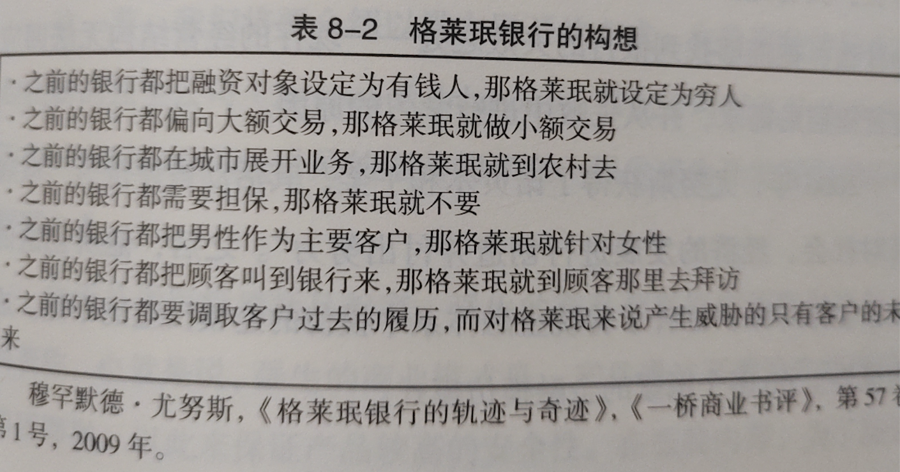

### 3.4 有时，自己本身也会成为一个反面教材

- 找到自己的界限，站在其对立面，进行自我否定

### 3.5 P-VAR 框架

- Position
  - .竞争定位
  - .客户分层
- Value
  - .有价值的提案
- Activity
  - .关键活动
  - .成长动力
  - .收益动力
- Resource
  - .关超性经营资派
  - .渠道
  - .与顾客的关系
  - .友好合作关系
- 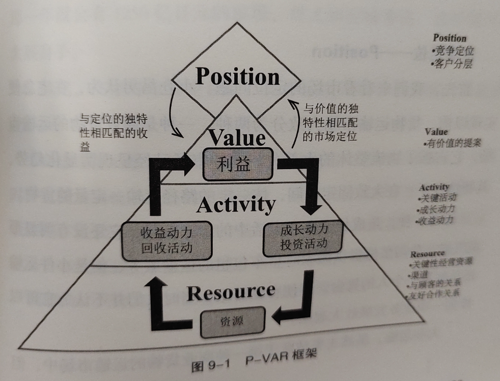

## 4 P-VAR（宅急便）+推论（一致法和差异法）+低成本实验+省却浪费的创业过程

### 4.1 P-VAR（宅急便）

- 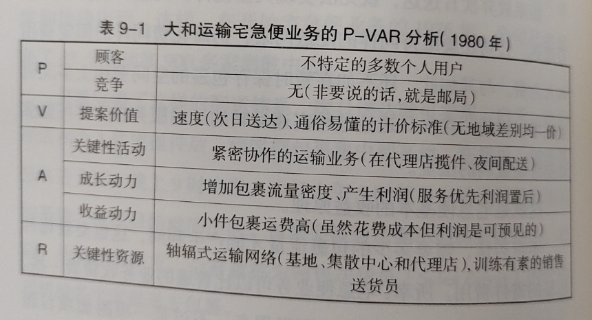
- P：顾客-不特定的多数个人用户
- P：竞争-无（非要说的话,就是邮局）
- V：提案价值-速度(次日送达)通俗易懂的计价标准（无地域差别均一价）
- A：关键性活动-紧密协作的运输业务（在代理店揽件、夜间配送）
- A：成长动力-增加包裹流量密度、产生利润（服务优先利润置后）
- A：收益动力-小件包裹运费高（虽然花费成本但利润是可预见的）
- R：关键性资源-轴辐式运输网络（基地、集散中心和代理店）,训练有素的销售送货员

### 4.2 推论（一致法）

- 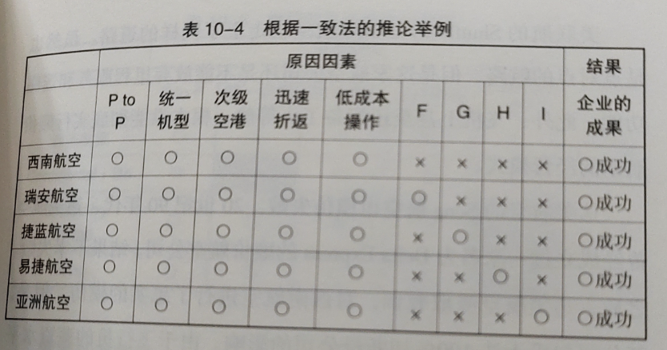

### 4.3 推论（差异法）

- 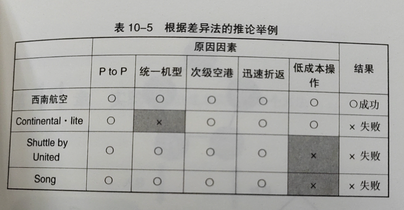

### 4.4 实验——低成本实验的三个方法

- 1.在脑海中实验
- 2.让别人来实验
- 3.小规模实验

### 4.5 省却浪费的创业过程

- 节制大规模调查，不要浪费成本与时间
- 如果已有设想与假说，那就尝试做出样本或最低限度的产品或服务
- 向顾客提出实际方案，并观察其反应
- 改善不足，如果预想存在偏差及时转换方向（Pivot）

## 5 P-VAR（星巴克）+P-VAR（罗多伦）+替代性学习+反面教材和模范教师+守破离

### 5.1 P-VAR（星巴克）

- 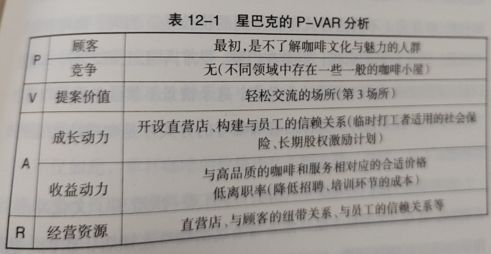
- P
  - 顾客：最初，是不了解咖啡文化与魅力的人群
  - 竞争：无（不同领域中存在一些一般的咖啡小屋）
- V
  - 提案价值：轻松交流的场所（第 3 场所）
- A
  - 成长动力：开设直营店、构建与员工的信赖关系（临时打工者适用的社会保险、长期股权激励计划）
  - 收益动力：与高品质的咖啡和服务相对应的合适价格低离职率（降低招聘、培训环节的成本）
- R
  - 经营资源：直营店、与顾客的纽带关系、与员工的信赖关系等

### 5.2 P-VAR（罗多伦）

- 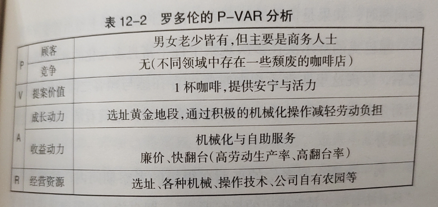

### 5.3 替代性学习

- 替代性学习（Vicarious Learning）：通过观察他人的语言、动作进行学习
- 经验学习（Experiential Learning）：根据自身的成功经验或失败教训进行学习

### 5.4 反面教材和模范教师

- 模仿对象可以是模范教师，还有反面教材，只有这两者同时具备，事业蓝图的规划才能更加清晰。同时，我们也能逐渐拥有自信：“就是这个！”

### 5.5 守破离

- 守：彻底的模仿
- 破：打破来自“模仿对象”的教导
- 离：确立起自己的模式
- 从肯定“模仿对象”出发，经过否定，最后描绘出一副与最初的“模仿对象”没有矛盾、完美统一的事业蓝图。
