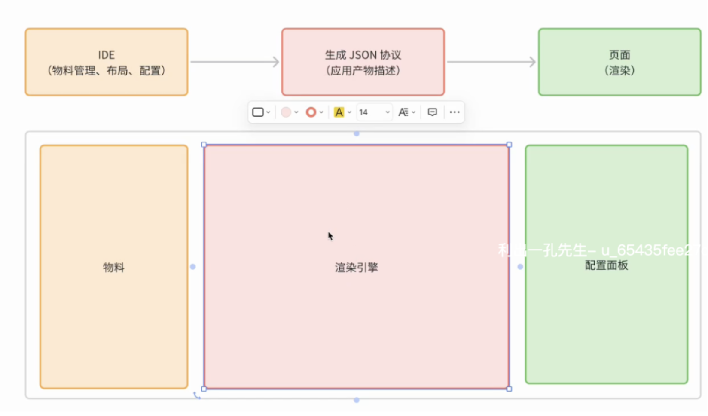

# [低代码可视化平台](https://po-files.ks3-cn-beijing.ksyun.com/63ac118738ecba723064bff2_65448f5c14498b3bdf65b2e7.pdf)

## 1

### 1.1 目录

1. 课程代码
2. 低代码平台工程架构与设计
3. 前端所需要掌握的完整技术框架
4. 插件化机制在物料管理中的应用
5. 渲染引擎设计与实践

### 1.2 低代码与无代码

- 无代码：普通用户
- 低代码：初级编程者，复杂度稍高，可代码植入（进一步即微前端）；流程引擎-拖拉拽组成业务流程；

### 1.3 架构



### 1.4 常规类开发

- plugin.js

```js
class Calculator {
  contructor() {}
  add() {}
  subtract() {}
  // ...
}
const calculator = new Calculator()
```

- 问题：扩展需要改动类 Calculator

### 1.5 插件化开发

- plugin.js

```js
/**
 * 所有插件都会在插件底座注册后，将插件注册到插件集中
 * 开发者只需考虑插件在插件集注册方式即可
 * 插件化设计主要涉及两块内容
 * 1. 插件底座
 * 2. 插件的注册方式
 * 3. 调用插件
 */
class Calculator {
  plugins = [] // 插件集
  contructor() {}
  /**
   *
   * @param {{name: string, fn: Function}} plugin
   */
  use(plugin) {
    this.plugins.push(plugin)
    this[plugin.name] = plugin.fn
  }
}

const AddPlguin = {
  name: 'add',
  fn(a, b) {
    return a + b
  },
}

const MinusPlguin = {
  name: 'minus',
  fn(a, b) {
    return a - b
  },
}

const calculator = new Calculator()
calculator.use(AddPlguin)
calculator.use(MinusPlguin)

console.log('calculator.add(1, 2):', calculator.add(1, 2))
console.log('calculator.minus(1, 2):', calculator.minus(1, 2))
```

- node plugin.js

## 2

### 2.1

### 2.2

### 2.3

### 2.4

### 2.5

## 3

### 3.1

### 3.2

### 3.3

### 3.4

### 3.5

## 4

### 4.1

### 4.2

### 4.3

### 4.4

### 4.5

## 5

### 5.1

### 5.2

### 5.3

### 5.4

### 5.5
