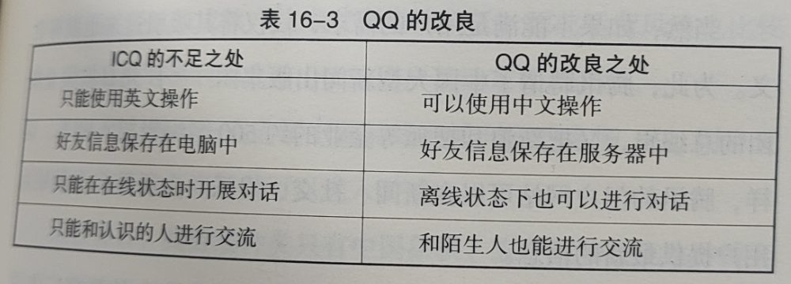

# 《从 1 到 100-模仿与创新的经营学》-井上达彦

## 1 复数模式+守、破、离与辩证法+明确矛盾、消解矛盾+守破离举例+自己、态度、实际

### 1.1 复数模式

- 

### 1.2 守、破、离与辩证法

- 辩证法是一种用来理解事物发展与变化的方法，有三个步骤组成。
- 思维方式：首先，明确一个命题（Thesis）；然后，提出与之相对的反命题（Antithesis），提取出问题和矛盾；最后，从相对高一级的维度消解矛盾，从而推导出综合命题（Synthesis）。

### 1.3 明确矛盾、消解矛盾

- 

### 1.4 守破离举例

- 

### 1.5 自己、态度、实际

- 比起“知识转移”，要作为自己的事情去面对；
- 比起“作为参考”，要态度认真；
- 比起“借东西”，要有成为自己东西的志向；
- 比起“类推”，要实际地付出行动；

## 2 格莱珉银行的逆转构想+P-VAR 分析（雅达利、任天堂、索尼）+罐子+P-VAR 分析（施乐和佳能）+事业结构

### 2.1 格莱珉银行的逆转构想

- 

### 2.2 P-VAR 分析（雅达利、任天堂、索尼）

- 

### 2.3 罐子

- “制造这个罐子的成本是多少钱？”-设计理念，如果不能以较低成本实际生产就没有任何意义。

### 2.4 P-VAR 分析（施乐和佳能）

- 

### 2.5 事业结构

- 

## 3

### 3.1 模仿战略

- 

### 3.2 模仿战略目的-竞争

- 

### 3.3 模仿战略目的-创新

### 3.4

### 3.5

## 4

### 4.1

### 4.2

### 4.3

### 4.4

### 4.5

## 5

### 5.1

### 5.2

### 5.3

### 5.4

### 5.5
