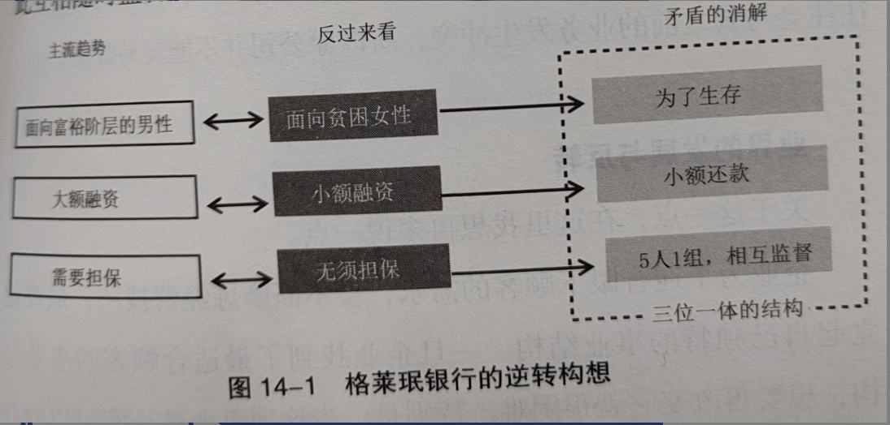
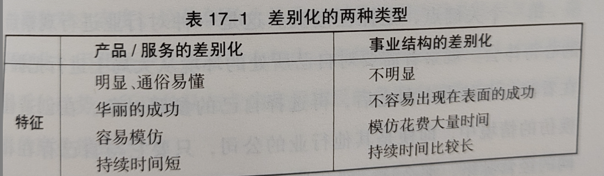

# 《从 1 到 100-模仿与创新的经营学》-井上达彦

## 1 复数模式+守、破、离与辩证法+明确矛盾、消解矛盾+守破离举例+自己、态度、实际

### 1.1 复数模式

- 

### 1.2 守、破、离与辩证法

- 辩证法是一种用来理解事物发展与变化的方法，有三个步骤组成。
- 思维方式：首先，明确一个命题（Thesis）；然后，提出与之相对的反命题（Antithesis），提取出问题和矛盾；最后，从相对高一级的维度消解矛盾，从而推导出综合命题（Synthesis）。

### 1.3 明确矛盾、消解矛盾

- 

### 1.4 守破离举例

- 

### 1.5 自己、态度、实际

- 比起“知识转移”，要作为自己的事情去面对；
- 比起“作为参考”，要态度认真；
- 比起“借东西”，要有成为自己东西的志向；
- 比起“类推”，要实际地付出行动；

## 2 格莱珉银行的逆转构想+P-VAR 分析（雅达利、任天堂、索尼）+罐子+P-VAR 分析（施乐和佳能）+事业结构

### 2.1 格莱珉银行的逆转构想

- 

### 2.2 P-VAR 分析（雅达利、任天堂、索尼）

- 

### 2.3 罐子

- “制造这个罐子的成本是多少钱？”-设计理念，如果不能以较低成本实际生产就没有任何意义。

### 2.4 P-VAR 分析（施乐和佳能）

- 

### 2.5 事业结构

- 

## 3 模仿战略（竞争+创新）+ QQ 的改良+先有山后成林

### 3.1 模仿战略

- 

### 3.2 模仿战略目的-竞争

- 

### 3.3 模仿战略目的-创新

### 3.4 QQ 的改良

- 

### 3.5 先有山后成林

- 先有山，后有林。有了树林和树木，才有枝丫与树叶。如果没有做好这样顺序的心理准备，就不可能获得成功。从家居来说，像碗厨应该怎么设计，这种单品层次的模仿就等于树叶。所以，首先我们需要对家庭装修的整体风格，也就是家庭这个场所进行必要的设想。在此基础上，我们再来选择房屋装修走哪种路线，最后才是色彩与功能的选择。

## 4

### 4.1 差别化的两种类型

- 

### 4.2 模仿方法

1. 看清大的潮流方向，再选择对象（行业）；
2. 融入模仿对象才能找到值得模仿的部分（对象）；
3. 积累经验，时常保持问题意识才能见微知著（自己）；

### 4.3 人才循环

- 在很长的产业历史中，一直存在是把人才当作是人还是物品来看的两种对立态度。但时代的潮流总是周而复始的。

### 4.4 创造

- 创造的基本就是模仿，不是天才也能创业。

### 4.5 大企业事实

- 从模仿中诞生创新之意外
- 不可模仿的结构诞生于模仿行为之悖论
