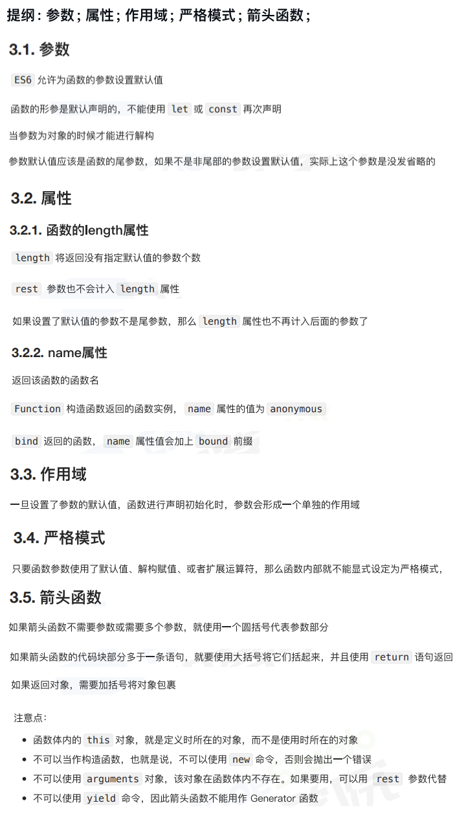
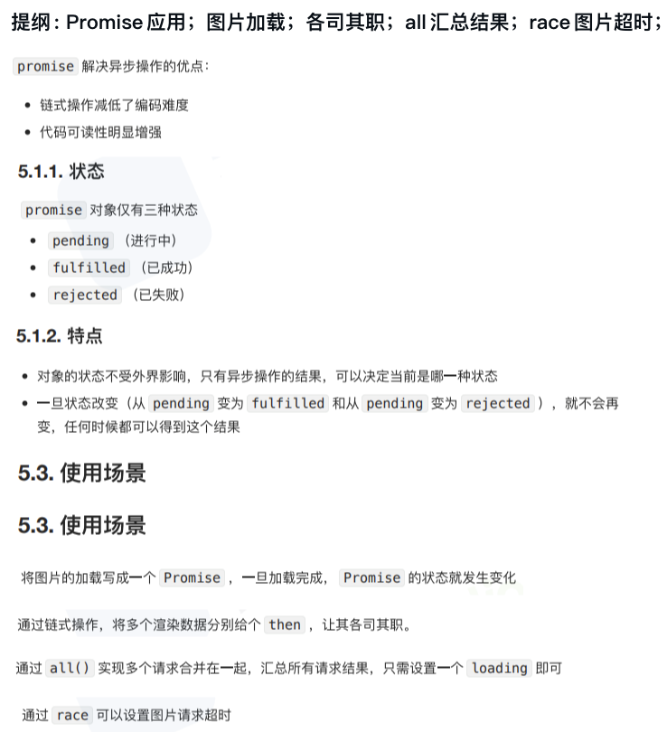
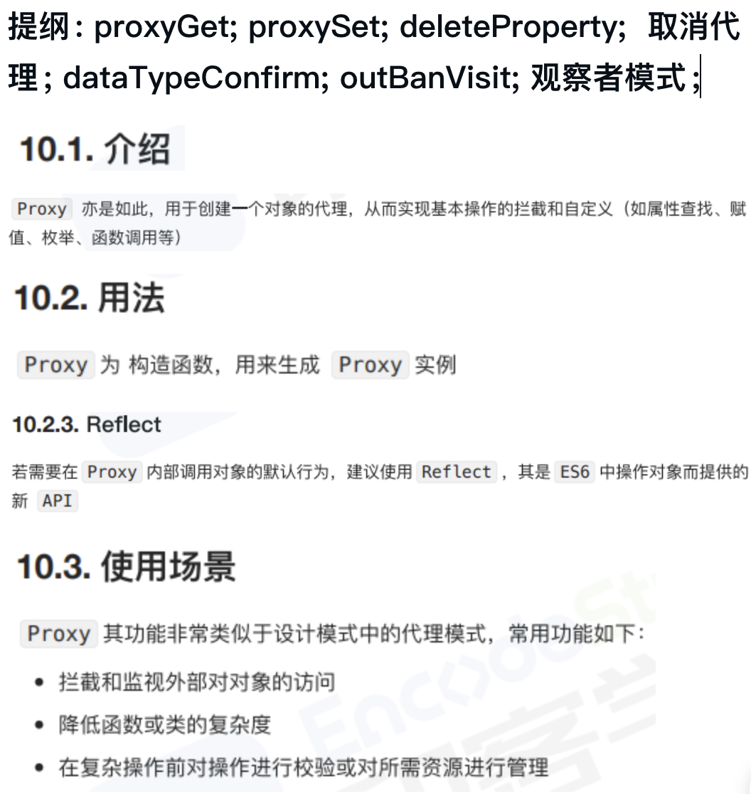
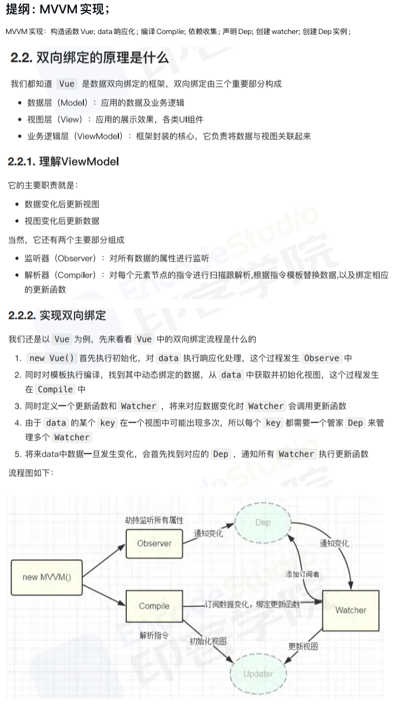
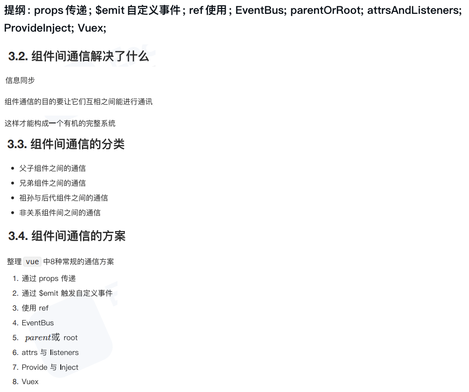
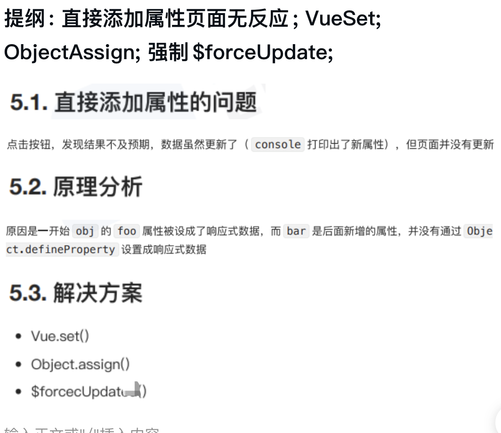
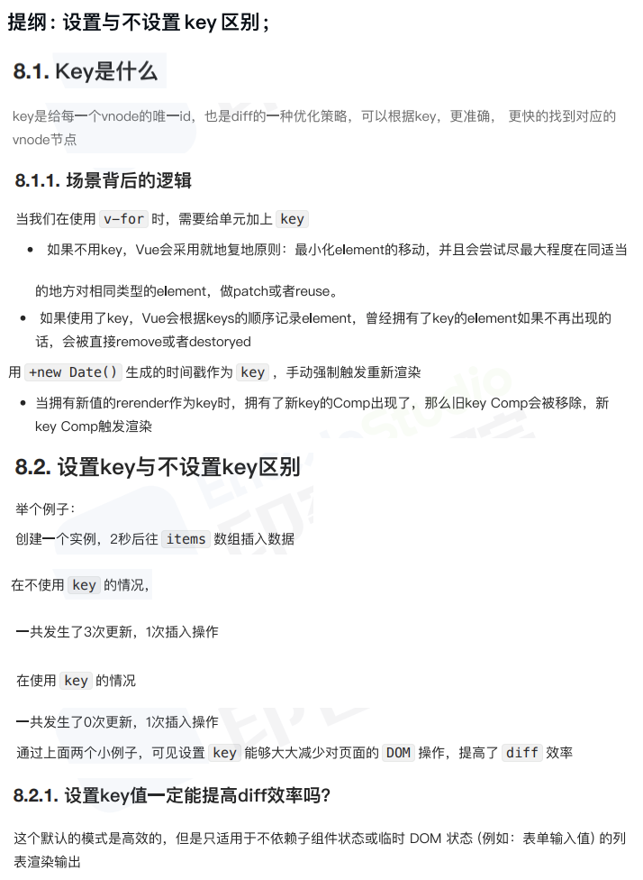

# REVIEW

## 1

### 1.1 [ES6函数新增了哪些扩展?](/public/1.example/1.FRONT_RW/3/5.ES6函数扩展.js)

提纲: 参数; 属性; 作用域; 严格模式; 箭头函数;

### 1.2 [对象新增了哪些扩展?](/public/1.example/1.FRONT_RW/4/1.ES6对象新增扩展.js)

提纲：属性的简写; 属性名表达式; super关键字; 扩展运算符的应用; 属性的遍历; 对象新增的方法;

### 1.3 [你是怎么理解ES6中 Promise的?使用场景?](/public/1.example/1.FRONT_RW/4/2.ES6Promise.js)

提纲: Promise应用；图片加载；各司其职；all汇总结果；race图片超时；

### 1.4 [你是怎么理解ES6中Proxy的?使用场景?](/public/1.example/1.FRONT_RW/4/3.ES6_Proxy.js)

提纲: proxyGet; proxySet; deleteProperty;  取消代理; dataTypeConfirm; outBanVisit; 观察者模式;

### 1.5 [双向数据绑定是什么？](/public/1.example/1.FRONT_RW/4/4.双向绑定.js)

提纲: MVVM实现；

## 2

### 2.1 [Vue组件之间的通信方式都有哪些?](/public/1.example/1.FRONT_RW/4/5.组件通信.html)

提纲: props传递; $emit自定义事件; ref使用; EventBus; parentOrRoot; attrsAndListeners; ProvideInject; Vuex;

### 2.2 [动态给vue的data添加一个新的属性时会发生什么?怎样解决?](/public/1.example/1.FRONT_RW/5/1.动态data.html)

提纲: 直接添加属性页面无反应; VueSet; ObjectAssign; 强制$forceUpdate;

### 2.3 [你知道vue中key的原理吗?说说你对它的理解?](/public/1.example/1.FRONT_RW/5/2.VueKey.html)

提纲: 不设置key3次DOM操作; 设置key1次DOM操作;

### 2.4

### 2.5

## 3

### 3.1

### 3.2

### 3.3

### 3.4

### 3.5

## 4

### 4.1

### 4.2

### 4.3

### 4.4

### 4.5

## 5

### 5.1

### 5.2

### 5.3

### 5.4

### 5.5
