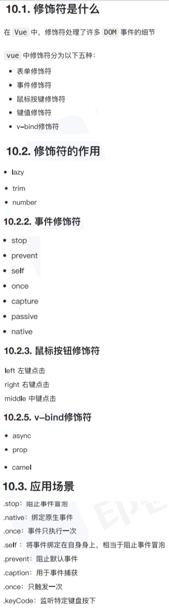
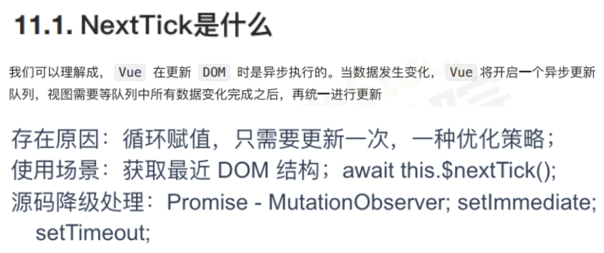
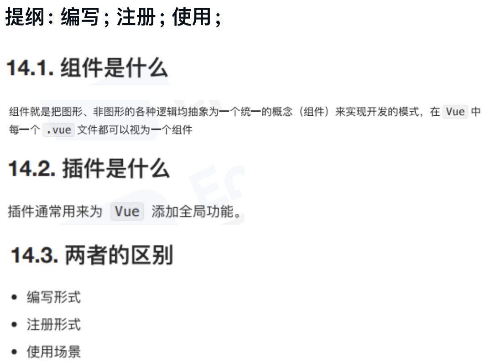
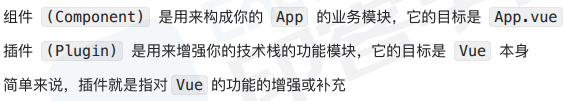
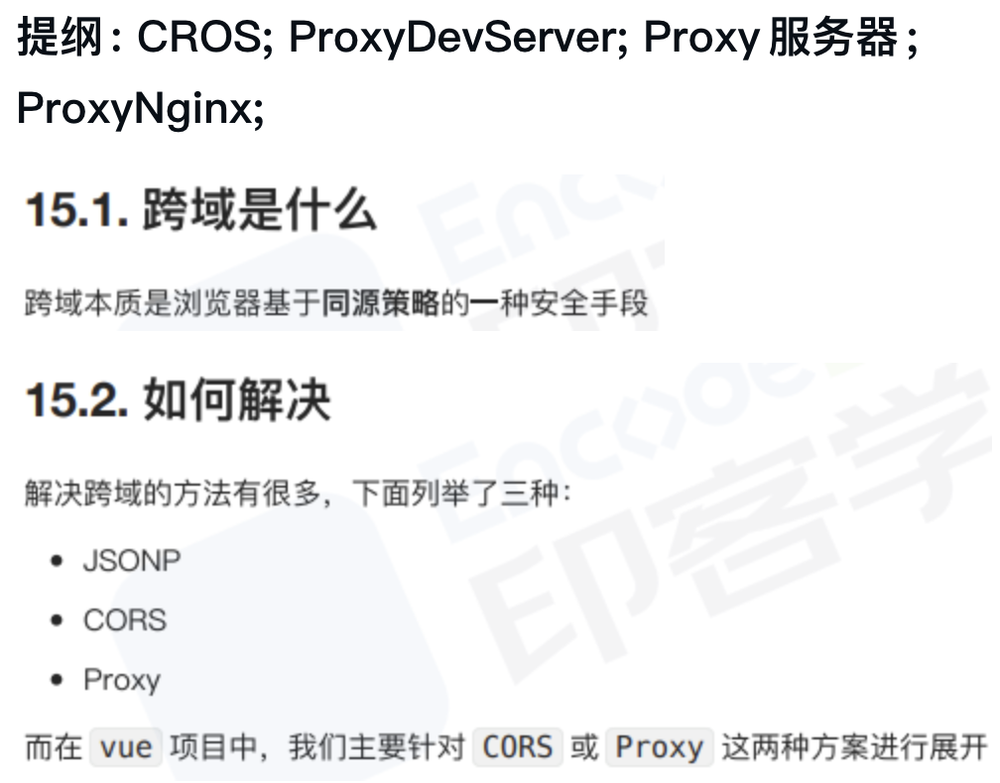
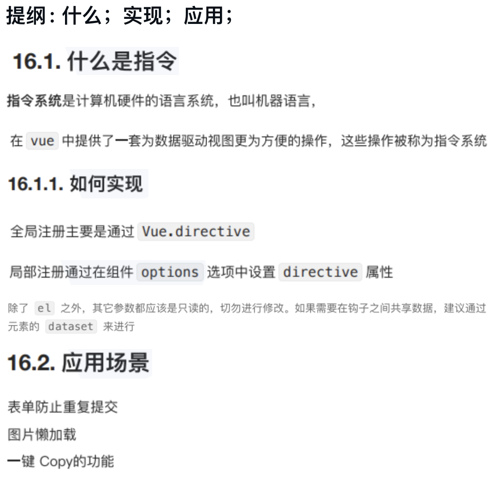
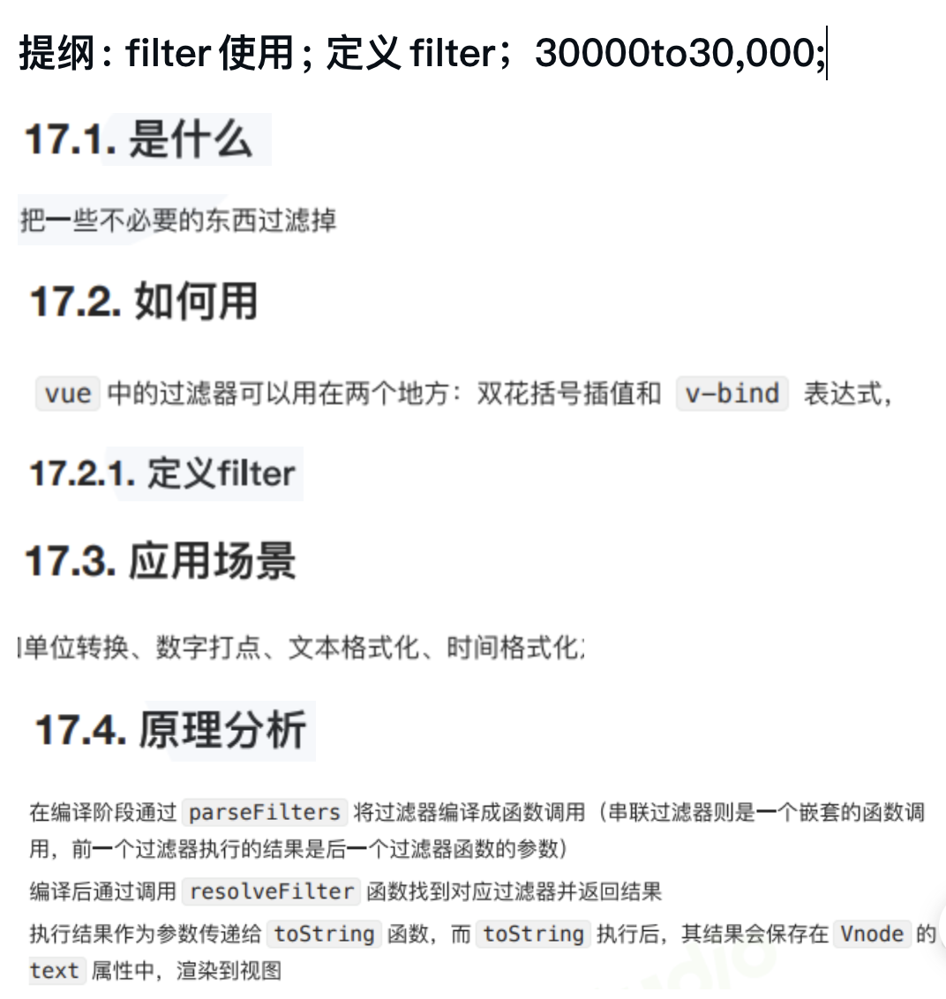
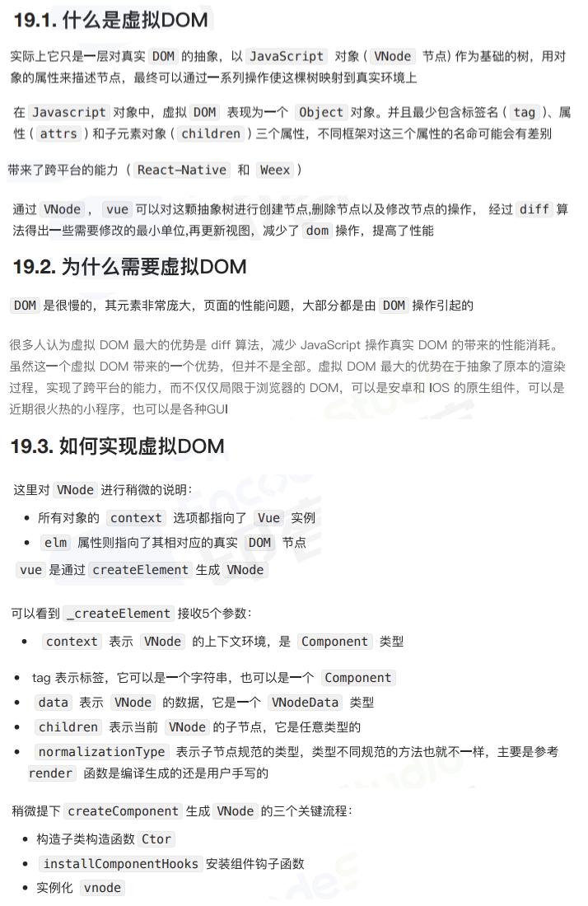
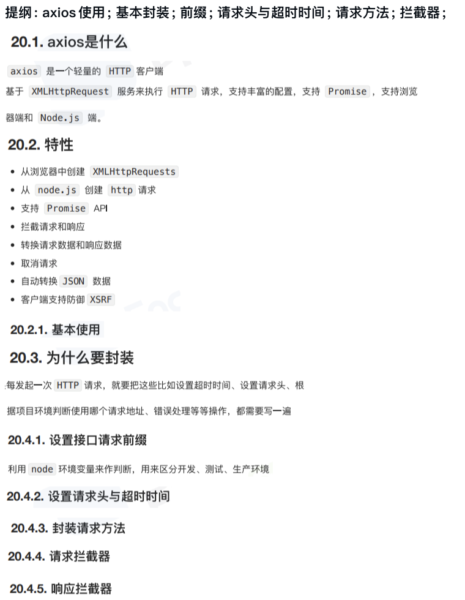

# REVIEW

## 1 G1

### 1.1 [ES6函数新增了哪些扩展?](../../../public/1.example/1.FRONT_RW/3/5.ES6函数扩展.js)

提纲: 参数; 属性; 作用域; 严格模式; 箭头函数;

### 1.2 [对象新增了哪些扩展?](../../../public/1.example/1.FRONT_RW/4/1.ES6对象新增扩展.js)

提纲：属性的简写; 属性名表达式; super关键字; 扩展运算符的应用; 属性的遍历; 对象新增的方法;

### 1.3 [你是怎么理解ES6中 Promise的?使用场景?](../../../public/1.example/1.FRONT_RW/4/2.ES6Promise.js)

提纲: Promise应用；图片加载；各司其职；all汇总结果；race图片超时；

### 1.4 [你是怎么理解ES6中Proxy的?使用场景?](../../../public/1.example/1.FRONT_RW/4/3.ES6_Proxy.js)

提纲: proxyGet; proxySet; deleteProperty;  取消代理; dataTypeConfirm; outBanVisit; 观察者模式;

### 1.5 [双向数据绑定是什么？](../../../public/1.example/1.FRONT_RW/4/4.双向绑定.js)

提纲: MVVM实现；

## 2 G2

### 2.1 [Vue组件之间的通信方式都有哪些?](../../../public/1.example/1.FRONT_RW/4/5.组件通信.html)

提纲: props传递; $emit自定义事件; ref使用; EventBus; parentOrRoot; attrsAndListeners; ProvideInject; Vuex;

### 2.2 [动态给vue的data添加一个新的属性时会发生什么?怎样解决?](../../../public/1.example/1.FRONT_RW/5/1.动态data.html)

提纲: 直接添加属性页面无反应; VueSet; ObjectAssign; 强制$forceUpdate;

### 2.3 [你知道vue中key的原理吗?说说你对它的理解?](../../../public/1.example/1.FRONT_RW/5/2.VueKey.html)

提纲: 不设置key3次DOM操作; 设置key1次DOM操作;

### 2.4 [Vue常用的修饰符有哪些有什么应用场景?](../../../public/1.example/1.FRONT_RW/5/2.Vue修饰符.html)

提纲: 表单修饰符; 事件修饰符; 鼠标修饰符; 键值修饰符; vBind修饰符;

### 2.5 Vue中的$nextTick有什么作用?

## 3 G3

### 3.1 [Vue中组件和插件有什么区别?](../../../public/1.example/1.FRONT_RW/5/3.Vue组件和插件区别.html)

提纲: 编写; 注册; 使用;

### 3.2 [Vue项目中你是如何解决跨域的呢?](../../../public/1.example/1.FRONT_RW/5/4.Vue跨域.js)

提纲: CROS; ProxyDevServer; Proxy服务器; ProxyNginx;

### 3.3 [有写过自定义指令吗?自定义指令的应用场景有哪些?](../../../public/1.example/1.FRONT_RW/5/4.Vue自定义指令.html)

提纲: 全局注册; 局部注册; 表单防止重复提交; 图片懒加载; 一键Copy;

### 3.4 [Vue中的过滤器了解吗?过滤器的应用场景有哪些?](../../../public/1.example/1.FRONT_RW/5/5.Vue过滤器.html)

提纲: filter使用; 定义filter；30000to30点000;

### 3.5 什么是虚拟DOM?如何实现一个虚拟DOM?说说你的思路?

## 4 G4

### 4.1 [Vue项目中有封装过axios吗?主要是封装哪方面的?](../../../public/1.example/2.FRONT_RW/1.VueAxios.html)

- [node文件](../../../public/1.example/2.FRONT_RW/1.server.js)

提纲: axios使用; 基本封装; 前缀; 请求头与超时时间; 请求方法; 拦截器;

### 4.2

### 4.3

### 4.4

### 4.5

## 5

### 5.1

### 5.2

### 5.3

### 5.4

### 5.5
