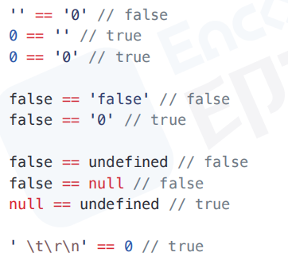

# JS_RW

## 1.`==` 和 `===` 区别，分别在什么情况使用？

### 1.1.`==` 相等

- 两个都为简单类型，字符串和布尔值都会转换成数值，再比较
- 简单类型与引用类型比较，对象转化成其原始类型(valueOf)的值，再比较
- 两个都为引用类型，则比较它们是否指向同一个对象
- null 和 undefined 相等
- 存在 NaN 则返回 false

### 1.2 `===` 严格比较值和类型是否相等

- 需要值和类型都相等

### 1.3 小结

- `==` 易错
  - 
- 除了对象属性为 null 或者 undefined 外，`==` 与 `===` 都可以用来比较值是否相等

## 2 typeof 与 instanceof 区别？

### 2.1 typeof 运算符

- 用来确定一个变量的数据类型
- 返回值：string、number、boolean、undefined、object、function、symbol
- 判断一个变量是否存在，可以使用 typeof

### 2.2 instanceof 运算符

- 用来判断一个对象是否属于某个构造函数的实例
- 返回值：true 或 false

### 2.3 区别

- typeof 运算符用来确定一个变量的数据类型，而 instanceof 运算符用来判断一个对象是否属于某个构造函数的实例
- typeof 运算符可以用来判断基本数据类型，而 instanceof 运算符只能用来判断引用类型
- typeof 运算符不能用来判断一个变量是否是 null 或 undefined，而 instanceof 运算符可以用来判断一个对象是否是某个构造函数的实例

## 3 JavaScript 原型，原型链？有什么特点？

### 3.1 JavaScript 原型

- 所有对象的原型都是 Object.prototype
- 每个函数都有一个 prototype 属性，指向一个对象，这个对象包含了这个函数的所有属性和方法
- 实例的 `__proto__` 属性指向它的原型

### 3.2 原型链

- 引用类型的值，比如数组、函数、对象等，都具有属性和方法
- 每个对象都会从原型上继承属性和方法
- 原型链的顶端是 Object.prototype
- 原型链的底端是 null

### 3.4 总结

- 一切对象都是继承自 Object 对象，Object 对象直接继承根源对象 null
- 一切函数对象都是继承自 Function 对象
- Object 对象直接继承自 Function 对象
- 原型链的作用是为了实现继承
- 原型链的底端是 null，即 Object.prototype
- 原型链的顶端是 Object.prototype，即所有对象的原型都是 Object.prototype

## 4 说说你对作用链的理解

### 4.1 作用域

1. 全局作用域
2. 函数作用域
3. 块级作用域-const|let

### 4.2 词法作用域

- 词法作用域是指在编译阶段就能确定作用域的一种机制

### 4.3 作用域链

- 作用域链是由作用域对象组成的链表，它会一直向上查询直到找到为止
- 作用域链的作用-有序访问
- 作用域链的前端始终都是当前执行的代码所在的作用域，后面则是外层作用域直到全局作用域

## 5 谈谈 this 对象的理解

- this 关键字是函数运行时，指向函数运行时所在的对象
- 它可以指向函数的直接调用者，也可以指向函数的间接调用者
- 它在函数调用的时候才会被绑定，在函数调用之前是不能被绑定的
- 它是函数运行时的属性，不是函数声明时的属性

### 5.1 this 定义

- 函数调用的时候，会自动绑定 this 关键字
- 无论函数如何调用，this 始终指向函数的直接调用者
- 只有函数内部没有 this 关键字，它才会指向函数的间接调用者或全局对象

### 5.2 this 绑定规则

1. 默认绑定：this 指向全局对象
2. 隐式绑定：this 指向函数的直接调用者
3. new 绑定：this 指向新创建的对象
4. 显式绑定：显示绑定：通过 call、apply、bind 改变函数内部 this 绑定

### 5.3 箭头函数

- 箭头函数没有自己的 this，它继承外层函数的 this，并且不能用作构造函数

### 5.4 优先级

- 优先级：new > 箭头函数 > 函数 > 全局对象

### 5.5 总结

- 箭头函数是 ES6 新增的语法，它的设计目的，是为了方便书写回调函数，并且减少不必要的 this 绑定，减少不必要的闭包操作
- 箭头函数的 this 绑定是基于词法作用域，而不是基于执行上下文的 this 绑定
