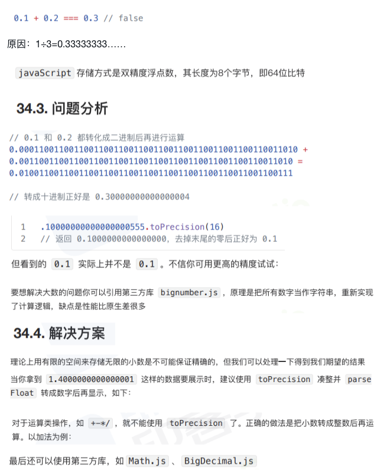

#

## 1 说说你对闭包的理解?闭包使用场景

闭包是一种特殊的函数，它可以访问并使用函数外部的变量，即使函数执行完毕后，该函数外部的变量也不会被销毁。

闭包的使用场景：

- 创建私有变量
- 延长变量的生命周期：实现一个函数，该函数可以访问外部变量，并返回一个函数。

## 2 谈谈 JavaScript 中的类型转换机制

JavaScript 类型转换机制：

- 显式转换 Number() parseInt() String() Boolean()
- 隐式转换：运算符 + 隐式转换，运算符 - 隐式转换，运算符 \* 隐式转换，运算符 / 隐式转换，运算符 % 隐式转换，运算符 ++ 隐式转换，运算符 -- 隐式转换，运算符 << 隐式转换，运算符 >> 隐式转换，运算符 >>> 隐式转换，运算符 & 隐式转换，运算

## 3 深拷贝浅拷贝的区别? 如何实现一个深拷贝?

- 深拷贝：深拷贝是指在一个对象中，如果该对象中有对象，则递归复制对象，而不是复制对象本身。
- 浅拷贝：浅拷贝是指在一个对象中，如果该对象中有对象，则复制对象的引用，而不是复制对象本身。

### 3.1

### 3.2

### 3.3

### 3.4

### 3.5

## 4 Javascript 中如何实现函数缓存?函数缓存有哪些应用场景？

### 4.1 函数缓存，就是将函数运算过的结果进行缓存本质上就是用空间 (缓存存储)换时间（计算过程）常用于缓存数据计算结果和缓存对象

### 4.2 如何实现

- 实现函数缓存主要依靠闭包、柯里化、高阶函数

### 4.3 [什么是防抖和节流?有什么区别?如何实现?](../../public/1.example/1.FRONT_RW/1.节流_防抖.js)

- 节流: n 秒内只运行一次，若在 n 秒内重复触发，只有一次生效
- 防抖: n 秒后在执行该事件，若在 n 秒内被重复触发，则重新计时
- 本质：优化高频率执行代码的一种手段；

### 4.4 [如何判断一个元素是否在可视区域中?](../../public/1.example/1.FRONT_RW/2.可视区域.html)

### 4.5 [如何实现上拉加载，下拉刷新?](../../public/1.example/1.FRONT_RW/3.pull_to_refresh.js)

- 上拉加载触底公式：`scrollTop + clientHeight >= scrollHeight`

## 5 [说说你对正则表达式的理解?应用场景?](../../public/1.example/1.FRONT_RW/4.regex.js)

### 5.1 [说说你对函数式编程的理解?优缺点?](../../public/1.example/1.FRONT_RW/5.函数式编程.js)

### 5.2 [JS如何实现继承?](../../public/1.example/1.FRONT_RW/1/1.js继承.js)

提纲：原型链；构造函数；组合；原型式；寄生式；寄生组合式；

### 5.3 [JS数字精度丢失?](../../public/1.example/1.FRONT_RW/1/2.js数字精度丢失.js)

提纲：浮点数；问题分析；解决方案；

### 5.4

### 5.5
