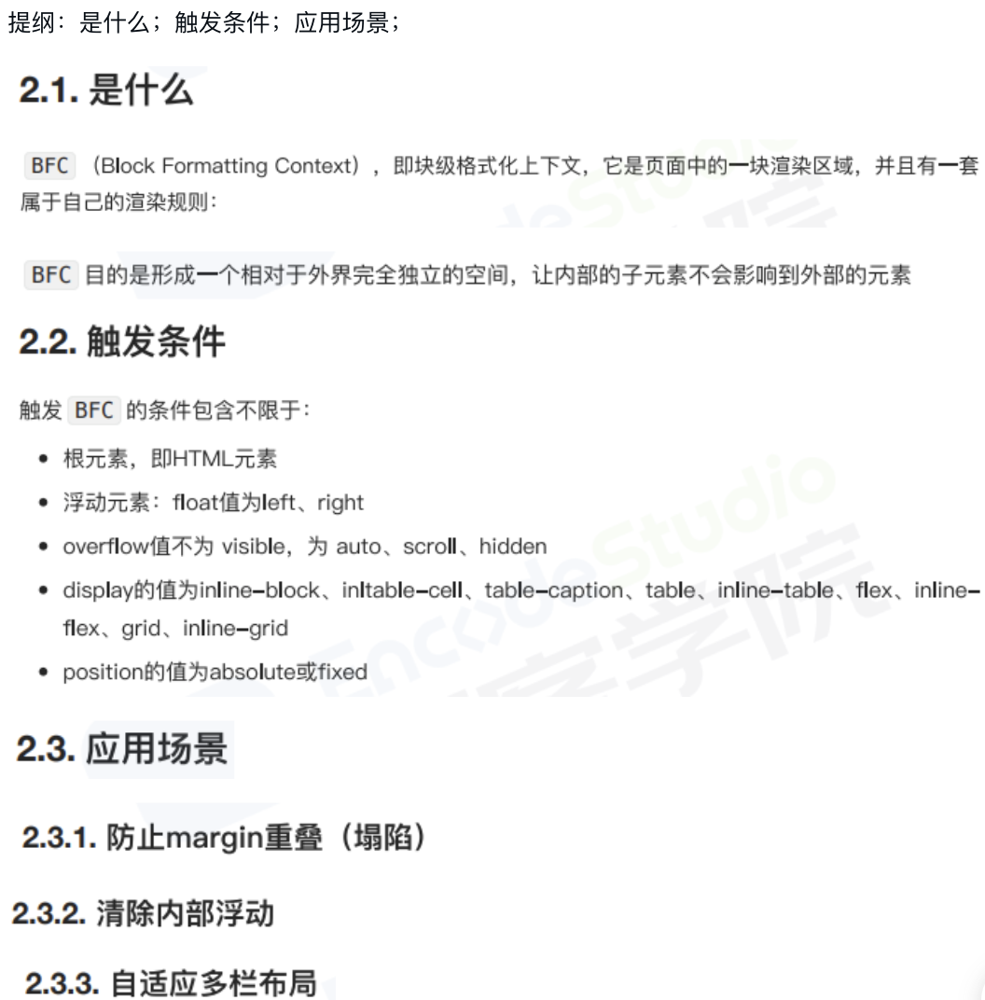
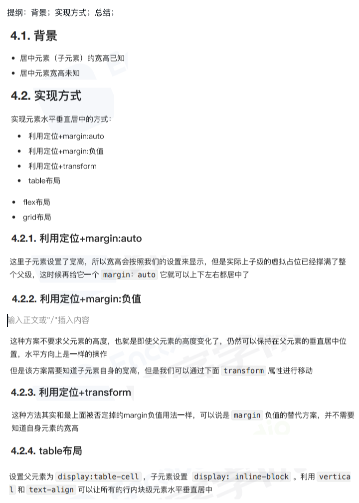
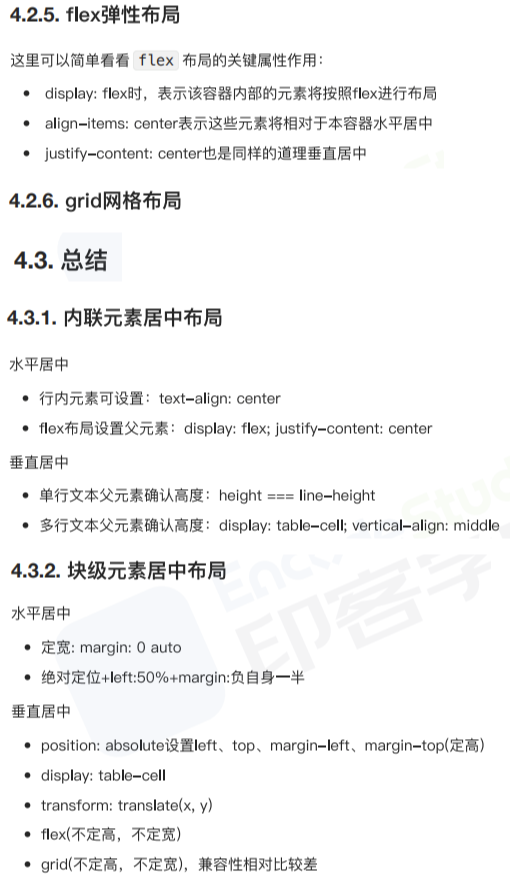
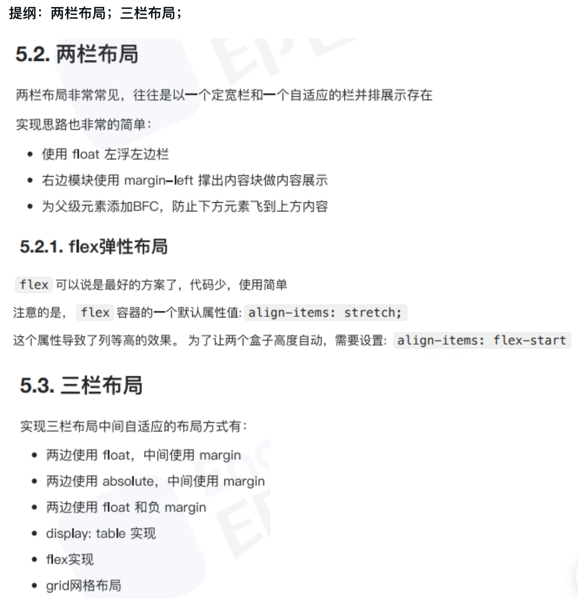
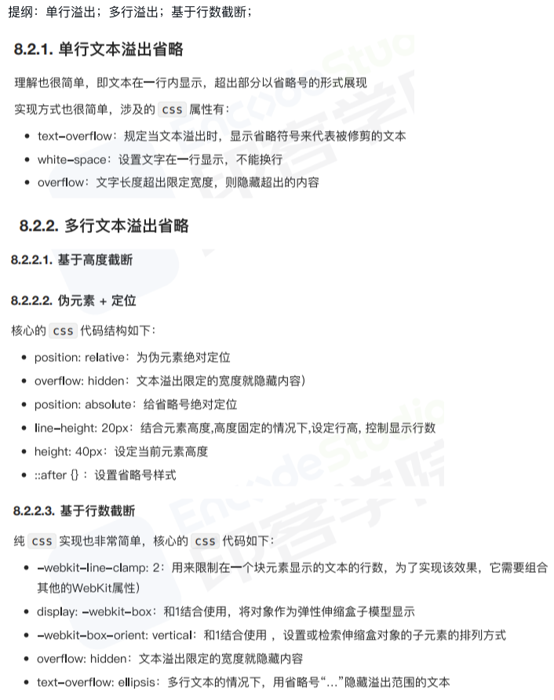
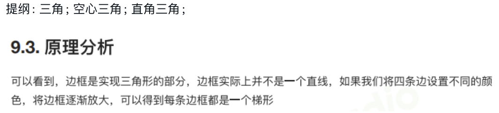
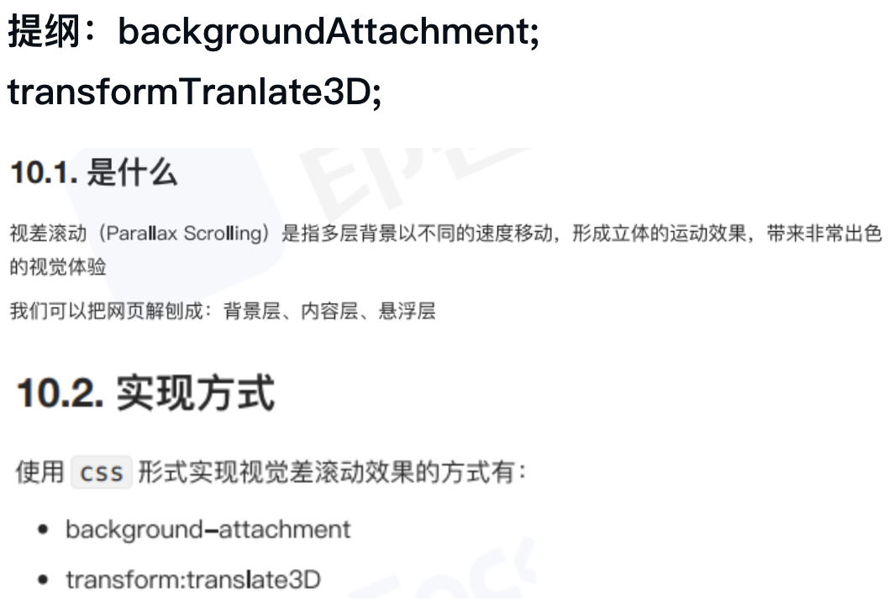
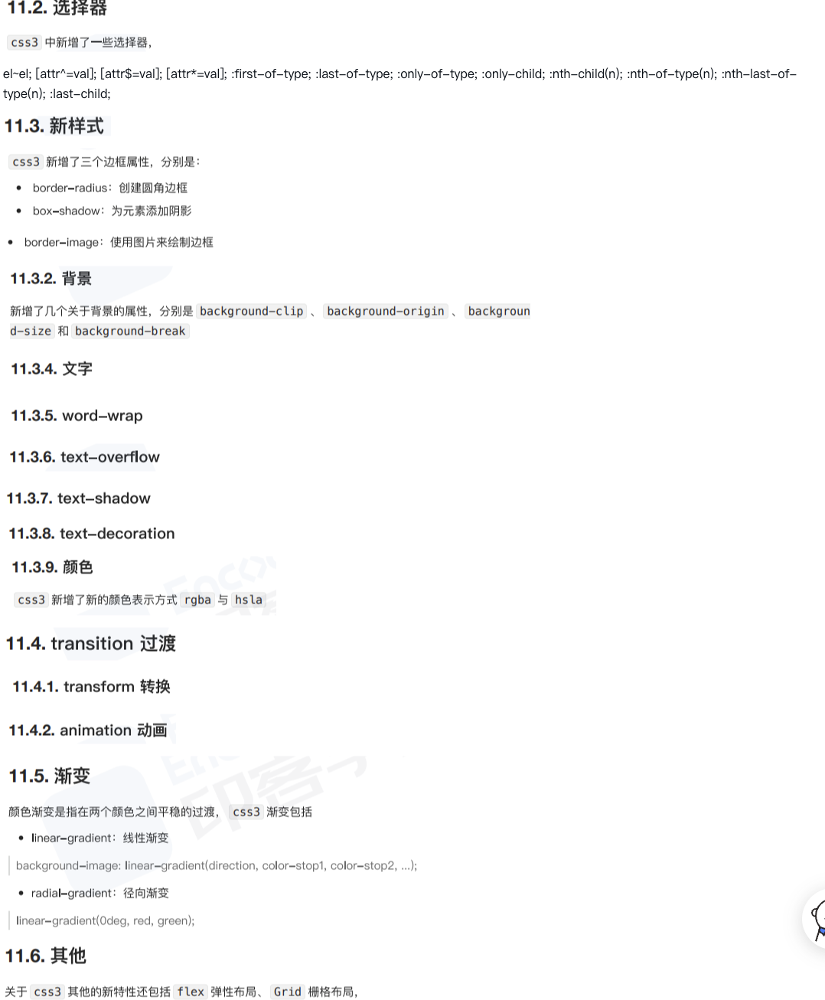

# CSS_RW

## 1

### 1.1 [BFC?](../../public/1.example/1.FRONT_RW/1/4.BFC.html)

提纲：是什么；触发条件；应用场景；

### 1.2 [元素水平居中?](../../public/1.example/1.FRONT_RW/1/5.元素水平居中.html)

提纲：背景；实现方式；总结；

### 1.3 [两栏布局右侧自适应_三栏布局中间自适应?](../../public/1.example/1.FRONT_RW/2/1.两栏布局右侧自适应_三栏布局中间自适应.html)

提纲：两栏布局；三栏布局；

### 1.4 [隐藏页面元素?](../../public/1.example/1.FRONT_RW/2/2.隐藏页面元素.html)

提纲：前沿；实现方式；区别；

### 1.5 [文本溢出?](../../public/1.example/1.FRONT_RW/2/3.文本溢出.html)

提纲：单行溢出；多行溢出；基于行数截断；

## 2

### 2.1 [CSS如何画一个三角形?原理是什么?](../../public/1.example/1.FRONT_RW/2/4.三角形.html)

提纲: 三角; 空心三角; 直角三角;

### 2.2 [如何使用css完成视差滚动效果?](../../public/1.example/1.FRONT_RW/2/5.视差滚动.html)

提纲: backgroundAttachment; transformTranlate3D;

### 2.3 [CSS3新增了哪些新特性?](../../public/1.example/1.FRONT_RW/1/1.CSS3新增特性.html)

### 2.4

### 2.5

## 3

### 3.1

### 3.2

### 3.3

### 3.4

### 3.5

## 4

### 4.1

### 4.2

### 4.3

### 4.4

### 4.5

## 5

### 5.1

### 5.2

### 5.3

### 5.4

### 5.5
