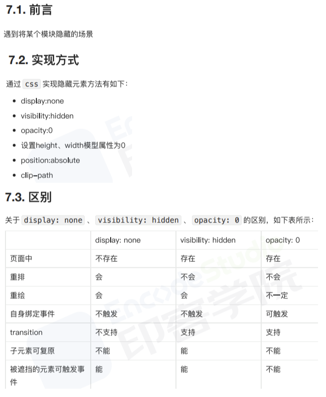
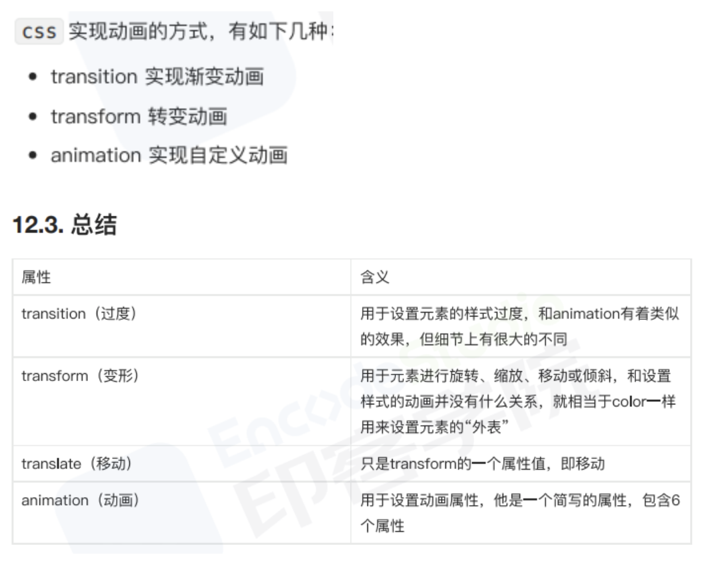
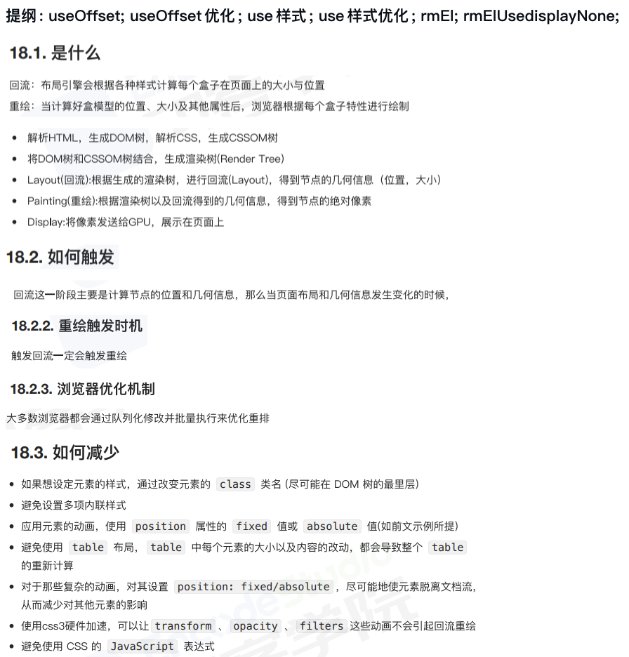
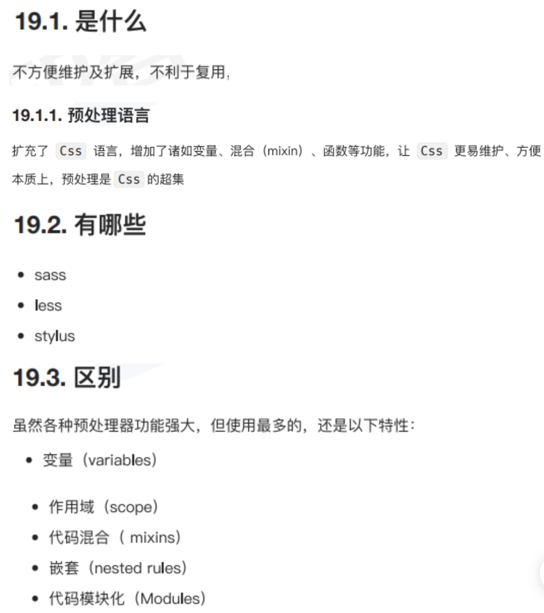
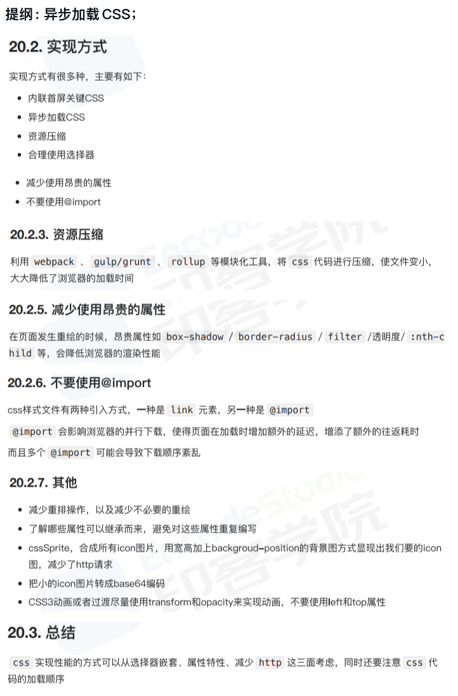

# CSS_RW

## 1

### 1.1 [BFC?](../../public/1.example/1.FRONT_RW/1/4.BFC.html)

提纲：是什么；触发条件；应用场景；

### 1.2 [元素水平居中?](../../public/1.example/1.FRONT_RW/1/5.元素水平居中.html)

提纲：背景；实现方式；总结；

### 1.3 [两栏布局右侧自适应_三栏布局中间自适应?](../../public/1.example/1.FRONT_RW/2/1.两栏布局右侧自适应_三栏布局中间自适应.html)

提纲：两栏布局；三栏布局；

### 1.4 [隐藏页面元素?](../../public/1.example/1.FRONT_RW/2/2.隐藏页面元素.html)

提纲：前沿；实现方式；区别；

### 1.5 [文本溢出?](../../public/1.example/1.FRONT_RW/2/3.文本溢出.html)

提纲：单行溢出；多行溢出；基于行数截断；

## 2

### 2.1 [CSS如何画一个三角形?原理是什么?](../../public/1.example/1.FRONT_RW/2/4.三角形.html)

提纲: 三角; 空心三角; 直角三角;

### 2.2 [如何使用css完成视差滚动效果?](../../public/1.example/1.FRONT_RW/2/5.视差滚动.html)

提纲: backgroundAttachment; transformTranlate3D;

### 2.3 CSS3新增了哪些新特性?

### 2.4 [CSS动画?](../../public/1.example/1.FRONT_RW/3/1.CSS动画.html)

提纲: transition; transform; animation;

### 2.5 [怎么理解回流跟重绘?什么场景下会触发?](../../public/1.example/1.FRONT_RW/3/2.回流_重绘.html)

提纲: useOffset; useOffset优化; use样式; use样式优化; rmEl; rmElUseDisplayNone;

## 3

### 3.1 [说说对Css预编语言的理解?有哪些区别?](../../public/1.example/1.FRONT_RW/3/3.Css预编语言/index.html)

提纲: 基本使用; 嵌套; 变量; 作用域; 混入; 代码模块化;

- [less](../../public/1.example/1.FRONT_RW/3/3.Css预编语言/less.less)
- [sass](../../public/1.example/1.FRONT_RW/3/3.Css预编语言/scss.scss)
- [stylus](../../public/1.example/1.FRONT_RW/3/3.Css预编语言/stylus.styl)

- `npm i -g stylus sass less`
- `npx lessc less.less less.css`
- `npx sass -w scss.scss:scss.css`
- `npx stylus -w stylus.styl -o stylus.css`

### 3.2 [CSS优化](../../public/1.example/1.FRONT_RW/3/4.CSS优化.html)

提纲: 异步加载CSS;

